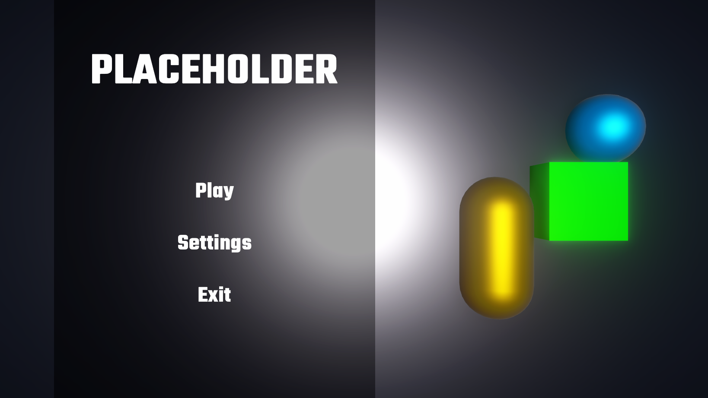

# Game Dev Minor (GDES) - Research UI Demo

# https://github.com/DitisAlex/research-ui-demo

## Demo - Main Menu [Difficulty: Basic]:

### 1) Download the sample code by cloning the repository
    1A) This sample code contains some background scenery, in which we will build our UI on.
    1B) The hierarchy of the asset folder is as following:

        ├── FPSFont                     # The font we will import later
        ├── Materials               
        ├── Scenes                  
        │   └── MainMenu.unity          # Drag this scene in hierarchy
        ├── Scripts                 
        │   └── CameraController.cs     # Simple camera controller for background scenery
        │   └── MenuController.cs       # Don't worry about it yet
        ├── UI                          # Our UI related stuff will go in here  
        │   └── SettingsTemplate.uxml   # Don't worry about it yet
        └── Template                    # Template Unity stuff
    1C) Open MainUnity scene.

### 2) Creating our .uxml file
    2A) Right click -> Create -> UI Toolkit -> UI Document
    2B) Name it "Menu.uxml".

### 3) Creating our first Visual Element
    3A) Open in UI builder (by double clicking).
    3B) Select "Match Game View" in inspector of "Menu.uxml".
    3C) Drag "Visual Element" from the Library section into the Hierarchy section.
    3D) Name this "Container" (if done correct it will become "#Container" in hierarchy).

### 4) Applying Selectors to Visual Element
    4A) Background -> Color -> Set opacity (alpha) to around 150-160
    4B) Size -> Width -> 45%
    4C) Margin & Padding -> Margin Left -> 50px

### 5) Test if Visual Element is visible in compile
    5A) Create empty GameObject.
    5B) Add UI Document component.
    5C) Drag and drop "Menu.uxml" in Source Asset.
    5D) For Panel Settings we create a default panel by right clicking in UI folder -> Create -> UI Toolkit -> Panel Settings Asset
    5E) Drag this Default Panel Setting file in Panel Settings.
    5F) Now if you press play you should be able to see a semi-transparant black background on top of the scenery.

### 6) Build the rest of the Visual Elements (make sure these are inside #Container)
    6A) Add Label field named "Title" with the following selectors:
        - Text (color): White
        - Attributes (text): Placeholder
        - Align (align items): Center
        - Margin & Padding (margin top): 40px
        - Text (size): 40px
        - Text (font asset): Add in our font from FPSFont folder (Square-Black SDF).

    NOTE: Names of these Visual Elements are important from now, as we will be referencing to these later

    6B) Add Visual Element named "Buttons" with the following selectors:
    
        - Flex (Grow): 1
        - Align (align items): Center
        - Align (justify content): Center
        - Margin & Padding (padding bottom): 15px
    
    NOTE: Inside #Buttons we will create three buttons, the easiest thing to do is to make one button and duplicate these.

    6C) Add Button named "PlayButton" with the following selectors:
        - Attributes (text): Play
        - Text (font asset): Add in our font from FPSFont folder (Square-Black SDF).

    6D) Before duplicating this we will apply a custom style to this. Head over to Style Class List in the inspector -> Type "menu-button" -> Press "Add Style Class To List". If done correctly you should now see a ".menu-button" in the list.

    6E) Duplicate #PlayButton and edit the following values:
        - Duplicate #1: Change name to "SettingsButton" and text to "Settings".
        - Duplicate #2: Change name to "ExitButton" and text to "Exit".

If you have followed all the steps to this point correctly, your UI Builder should look similiar to this:

### 7) Create our .uss file
    7A) Click on the + at the StyleSheets section.
    7B) Create New USS -> Locate UI folder -> Save as "MenuStyles.uss"
    7C) Create a new selector in the inspector by referencing the ".menu-button" selector we made earlier. To do this:
        - Click MenuStyles.uss
        - Go to inspector 
        - Fill in ".menu-button" in the selector field (the . is important).
        - Click "Create New USS Selector"
    7D) Any selector changes we make inside this .uss file will now be automatically applied to any elements with the ".menu-button" selector. We are going to apply some selectors to all of these buttons:
        - Text (color): White
        - Background (opacity): 0%
        - Size (height): 25px
        - Margin & Padding (margin): 10px
        - Text (size): 20px

### 8) Attach Script to our UI buttons
    8A) Open /Scripts/MenuController.cs.
    8B) This code has all the basic stuff to reference parts of the UI with callback methods for the buttons, make sure that the names of the rootVisualElement are equal to the ones you defined in UI Builder.
    8C) Add this Script component to the earlier made GameObject.
    8D) If you done all the previous parts correctly, there should be Debug.Logs upon button clicks.

### 9) Template .uxml files
    Some sections of our UI should ideally be dynamic, such as the settings screen. For this you can create a template file and reference to this later. The demo has already made a template file with some simple buttons similiar to how you made the buttons earlier.
    9A) Implement this by uncommenting the code parts in "MenuController.cs".
    9B) Drag UI/SettingsTemplate.uxml inside the Script component.
    9C) If implemented correctly, you now have different buttons when clicking on "Settings".

### Bonus: Add some hover animations on buttons
    A) Add a new selector reference and name this one ".menu-button:hover"
    B) Apply these selectors:
        - Text (size): 25px
        - Text (color): any color (recommendation: gray)
        - Transform Animations (duration): 0.2s
    C) Apply Transform Animations (duration): 0.2s to the regular ".menu-button" selector aswell.
    D) Test by clicking on the Preview button in Viewport section

## Demo - HUD [Difficulty: Advanced]:

The file will contain the basic scene with some placeholder elements. Here you will learn to make a quest bar and a toolbar and see how you can set the style of the buttons, so they will adjust dynamically.

Open the Assets folder and open the Main HUD. This will take you to UI Builder.

### 1) Minimap

    1A) Create a new visual element and drag it as a child of "Main HUD". Name this element "minimap".
	1B) Size: Width(20%), Height(40%) , Position: Absolute, Left(80%), the rest on auto.
	1C) Background: Choose the picture "minimap.png". 
	1D) Border: 5 px. Choose a color of your choice.

### 2) Quests
	2A) Create a new visual element and drag it as a child of "Main HUD". Name this element "QuestMenu".
	2B) Size: Width(20%), Height(60%), Position: absolute, Left(80), Top(40)
	2C) Create a new visual element and drag it as a child of "QuestMenu". Name this element "QuestMenuBox".
	2D) Create a new visual element and drag it as a child of "QuestMenuBox". Call this item "Quest".
	2E) Create a new class for the quest by pressing the + in left top corner and "Create New USS". Name this "Main HUD.uss".
	2F) Go to the inspector in the right and in the selector field type in ".quest"
	2G) Change the settings in here: 
		Shrink(1), Grow(0). 
		Size: Width(auto), height(auto). 
		Border: Left(0), Right(0), Top(3px), Bottom(3px). 
	2H) Drag the class ".quest" to the quest element and duplicate until you have 4 quest slots.

### 3) Toolbar
	3A) Create a new visual element and drag it as a child of "Main HUD". Name this element "Toolbar".
	3B) Edit the settings for this:
		Size: Height(10%), Width(500px)
		Position: Absolute, Left(25%), Top(90%).
		Background: Add a colour to your liking
	3C) Create a new visual element and drag it as a child of "Toolbar". Name this element "ToolbarCell".
	3D) Go to the top left corner and select the "Main HUD" - in the Selector field in the right create a new class called ".toolbarCell"
	3E) Drag this to the ToolbarCell and change the settings in here:
		Position: Relative, Left(auto), Top(auto), Right(auto), Botton(Auto)
		Flex should be changed in each individual cell and set to Grow(1), shrink(1)

### 4) Healthbar

